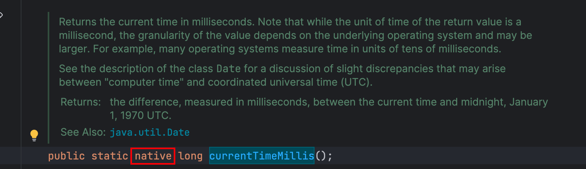
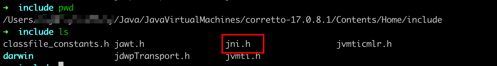
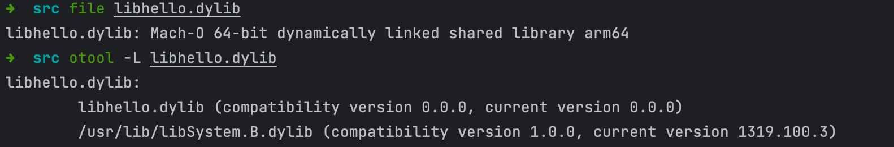
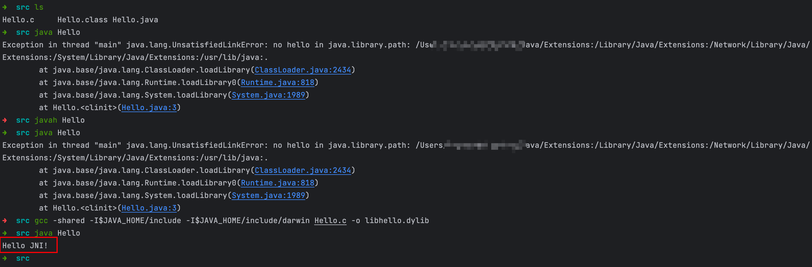

# [面试炫技系列～] 浅谈`JNI`

缘起：

最近在研究`JVM` 的时候发现很多地方用到了`native` 函数，之前一直是在八股面试，刚好有一次面试被问到`jvm` 与本地方法的交互流程，当时是一脸懵的，面试完了之后也一直没有好好总结，趁着这会有时间，简单学习一下吧，有所了解才能更好地背八股不是～



> 环境：`jdk17 + clang-1403.0.22.14.1 ` 其中`clang` 为`gcc` 提供`c` 系编译环境。

## `JNI `是什么

> `JNI `（`Java Native Interface`，Java本地接口）是一种编程框架，使得Java虚拟机中的Java程序可以调用本地应用/或库，也可以被其他程序调用。 本地程序一般是用其它语言（C、C++或汇编语言等）编写的，并且被编译为基于本机硬件和操作系统的程序。

## 为什么需要`JNI`

> 有些事情Java无法处理时，JNI允许程序员用其他编程语言来解决，例如，Java标准库不支持的平台相关功能或者程序库。也用于改造已存在的用其它语言写的程序，供Java程序调用。许多基于JNI的标准库提供了很多功能给程序员使用，例如文件I/O、音频相关的功能。当然，也有各种高性能的程序，以及平台相关的API实现，允许所有Java应用程序安全并且平台独立地使用这些功能。

总结起来：

1. 平台相关的功能，通常是为了追求性能，需要对Java虚拟机进行扩展，需要使用`Native` 的实现。
2. `Native`的实现是已经存在的功能，使用JNI协议，方便使用已有的功能，不需要重新的`Java` 实现。
3. `Java`的`.class`文件安全性较差，增加安全性，将重要的逻辑在`Native`代码中实现。

我们来看一个`Hello JNI`例子。

## `Hello JNI`

在编程的世界里，第一个程序永远都是`Hello World`，我们这里来完成一个`Hello JNI`的例子。

> 需求： 在`Java`中调用`Native`方法，`Native`方法输出`Hello JNI`。

## Java代码

我们先准备`Java`侧的代码。

```java
// Hello.java
public class Hello {
    static {
        System.loadLibrary("hello");
    }

    public native void sayHello();

    public static void main(String[] args) {
        new Hello().sayHello();
    }
}
```

首先定义了一个`Hello`类。

其中的`static`代码块是JVM在加载类时执行的，`System.loadLibrary()`表明需要加载动态库`hello`，在不同的系统平台上对应不同的名字。

* 在`Windows`平台上查找的是`hello.dll`；

* 在`Linux`平台上查找的是`libhello.so`；

* 而在`MacOS`平台上查找的是`libhello.dylib`。

这个库应该被放在Java库的搜索路径中，可以通过`-Djava.library.path=/path/to/lib`将其加入到搜索路径中。如果路径下没有找到要导入的库，会在抛出`UnsatisfiedLinkError`错误。

然后声明了`sayHello`的`native`方法，通过`native`关键字来表明这个方法的实现不在`Java`中。它的实现应该在`hello`库中。

最后是我们的测试程序，调用`native`方法`sayHello()`。

## 生成头文件

首先，编译Java程序：

```java
javac Hello.java
```

生成`Hello.class`。生成头文件使用`javah`命令：

```java
javah Hello
```

生成头文件`Hello.h`。

内容为：

```cpp
/* DO NOT EDIT THIS FILE - it is machine generated */
#include <jni.h>
/* Header for class Hello */

#ifndef _Included_Hello
#define _Included_Hello
#ifdef __cplusplus
extern "C" {
#endif
/*
 * Class:     Hello
 * Method:    sayHello
 * Signature: ()V
 */
JNIEXPORT void JNICALL Java_Hello_sayHello
  (JNIEnv *, jobject);

#ifdef __cplusplus
}
#endif
#endif

```

首先，包含的头文件`jni.h`，它是`JDK`提供的，位于`<JAVA_HOME>/include`目录中，以及平台相关的`<JAVA_HOME>/include/win32`、`<JAVA_HOME>/include/linux`、`<JAVA_HOME>/include/darwin`目录下。



接着，这个头文件声明根据`Java`中的声明的`native`方法，生成了一个`C`函数的声明`Java_Hello_sayHello`：

```java
JNIEXPORT void JNICALL Java_Hello_sayHello(JNIEnv *, jobject);
```

`Java` 中的` native` 方法到`C` 函数的命名规则为：

```cpp
Java_{package_and_classname}_{function_name}();
```

所有方法以`Java_`开头，接着是包名和类名，以`_`替换`.`，最后是方法名。

在Java中`sayHello`是没有参数的方法，但是在生成的C函数声明中有两个参数，它们是每个方法都会传递的参数，分别为：

- `JNIEnv*`，指向JNI环境的指针，通过它可以使用JNI协议提供的接口（函数）。
- `jobject`，指向`this`的指针，用于获取类相关的信息（变量、方法等）。

对于`JNIEXPORT`和`JNICALL`两个宏，用于设置函数可见性，以及调用栈约定，这里可以忽略这两个宏。

## 实现native方法

在`hello.c`中来实现函数`Java_Hello_sayHello`

```java
#include "Hello.h"
#include <jni.h>
#include <stdio.h>

JNIEXPORT void JNICALL Java_Hello_sayHello (JNIEnv *env, jobject obj) {
  printf("Hello JNI!\n");
}
```

## 不同平台编译

在不同的平台上编译方法有所区别。

### Linux

```java
gcc -shared -I$JAVA_HOME/include -I$JAVA_HOME/include/linux Hello.c -o libhello.so
```

编译生成`libhello.so`。

### Windows

```java
gcc -Wl,--add-stdcall-alias -shared -I"%JAVA_HOME%\include" -I"%JAVA_HOME%\include\win32" Hello.c -o hello.dll
```

编译生成`hello.dll`。

### Macos

```shell
gcc -shared -I$JAVA_HOME/include -I$JAVA_HOME/include/darwin Hello.c -o libhello.dylib
```

编译生成`libhello.dylib`。

查看`libhello.dylib` 内容：



如上图所示：

使用`file`命令查看编译后的动态链接库文件的内容为

```shell
libhello.dylib: Mach-O 64-bit dynamically linked shared library arm64
```

> `chatgpt` 对文件内容的解答：
>
> 这个信息表明`libhello.dylib`是一个Mach-O格式的64位动态链接的共享库，它是针对arm64架构编译的。
>
> Mach-O（Mach Object）是一种可执行文件格式，用于在Mac OS X和iOS操作系统上存储可执行代码、共享库和对象文件。它是苹果公司的操作系统上的通用格式。
>
> 64位指示该共享库是针对64位处理器架构编译的，arm64是一种基于ARM架构的64位处理器架构，广泛用于移动设备和嵌入式系统。
>
> 动态链接意味着共享库在运行时与其他代码进行链接，而不是在编译时。这使得在程序运行过程中可以动态加载和卸载共享库，并提供了更高的灵活性和可重用性。
>
> 因此，`libhello.dylib`是一个针对arm64架构编译的64位动态链接的共享库，可以在Mac OS X和iOS系统上使用。

`otool`查看编译得到的动态库的依赖库信息为

```text
libhello.dylib:
        libhello.dylib (compatibility version 0.0.0, current version 0.0.0)
        /usr/lib/libSystem.B.dylib (compatibility version 1.0.0, current version 1319.100.3)

```

> `chatgpt` 对文件内容的解答
>
> 这个信息提供了关于`libhello.dylib`共享库及其依赖的一些版本信息。
>
> - `libhello.dylib`的兼容性版本（compatibility version）和当前版本（current version）都是0.0.0。兼容性版本表示共享库与其他使用该库的程序的兼容性，而当前版本表示共享库的当前版本号。在此情况下，版本号为0.0.0，这可能是一个初始版本或者未指定具体版本号。
> - 共享库依赖于`/usr/lib/libSystem.B.dylib`，其兼容性版本为1.0.0，当前版本为1319.100.3。`libSystem.B.dylib`是Mac OS X系统中的一个系统库，提供了许多常用的系统函数和服务。共享库通过依赖于`libSystem.B.dylib`来使用其中的功能。
>
> 这些版本信息有助于了解共享库与其他代码的兼容性，并且可以帮助开发人员进行正确的库版本管理。


> `chatgpt` 对该行命令的介绍：
>
> 这条命令是用于编译C代码并生成一个共享库（dynamic library），供Java程序调用。下面逐步解释每个参数的含义：
>
> 1. `gcc`：是GNU Compiler Collection的缩写，是一个用于编译C和C++代码的开源编译器。
> 2. `-shared`：表示生成一个共享库，也称为动态链接库（dynamic library）。
> 3. `-I$JAVA_HOME/include`：告诉编译器在`$JAVA_HOME/include`目录中查找所需的头文件（header files）。`$JAVA_HOME`是Java安装路径的环境变量。
> 4. `-I$JAVA_HOME/include/darwin`：告诉编译器在`$JAVA_HOME/include/darwin`目录中查找所需的头文件。`darwin`是Mac OS X平台的子目录，用于存放与操作系统相关的头文件。
> 5. `Hello.c`：要编译的C源文件的文件名。
> 6. `-o libhello.dylib`：指定生成的共享库的输出文件名为`libhello.dylib`。`.dylib`是Mac OS X平台的共享库文件扩展名。
>
> 这条命令的作用是将`Hello.c`编译为一个共享库文件`libhello.dylib`，以供Java程序调用。
>
> 请注意，该命令假设你已经正确安装了gcc编译器，并且设置了正确的`$JAVA_HOME`环境变量。如果你在其他操作系统上使用该命令，可能需要修改`-I$JAVA_HOME/include/darwin`参数中的平台相关子目录。

---


> 为什么目标文件要以`lib`开头
>
> `chatgpt`答疑：
>
> 在命令行中，库文件的命名约定是以"lib"开头，并以库的名称和适当的扩展名结尾。
>
> 在Mac OS X平台上，共享库的扩展名是`.dylib`，所以通常库文件的命名约定是以`lib`开头，后面跟着库的名称，然后是`.dylib`扩展名。这是为了与静态库（`.a`文件）进行区分。
>
> 因此，如果你将共享库的文件名改为`hello.dylib`而不是`libhello.dylib`，系统会认为它是一个不符合命名约定的文件，因此无法找到它。
>
> 所以，请确保按照命名约定将共享库文件命名为`libhello.dylib`，这样它才能被正确地识别和使用。

## 运行Java程序

```java
java -Djava.library.path=. Hello
```

或者

```java
java Hello
```

因为我们编译生成的库文件，是在当前目录，可以不指定库查找目录，当前目录默认为库查找目录。

输出`Hello JNI!`。

至此， 我们已经走通了从`Java`调用`native`的路径。

如果不生成`Hello.h` 或者不编译`Hello.c`直接运行`Hello.class` 则会报如下错误：



## 使用C++实现

相比较于C的实现，C++区别不大，将实现的文件由`Hello.c`命名为`Hello.cc`，内容为：

```java
#include "Hello.h"
#include <jni.h>
#include <iostream>

JNIEXPORT void JNICALL Java_Hello_sayHello (JNIEnv *env, jobject obj) {
  std::cout << "Hello JNI from C++!" << std::endl;
}
```

## 编译

这里以Macos平台为例：

```java
g++ -shared -I$JAVA_HOME/include -I$JAVA_HOME/include/darwin Hello.cpp -o libhello.dylib
```

其他步骤与`C `的实现一致。


# 参考

* [dylib动态库加载过程分析](https://zhuanlan.zhihu.com/p/24875905)
* [jni简介](https://zhuanlan.zhihu.com/p/349928909)

